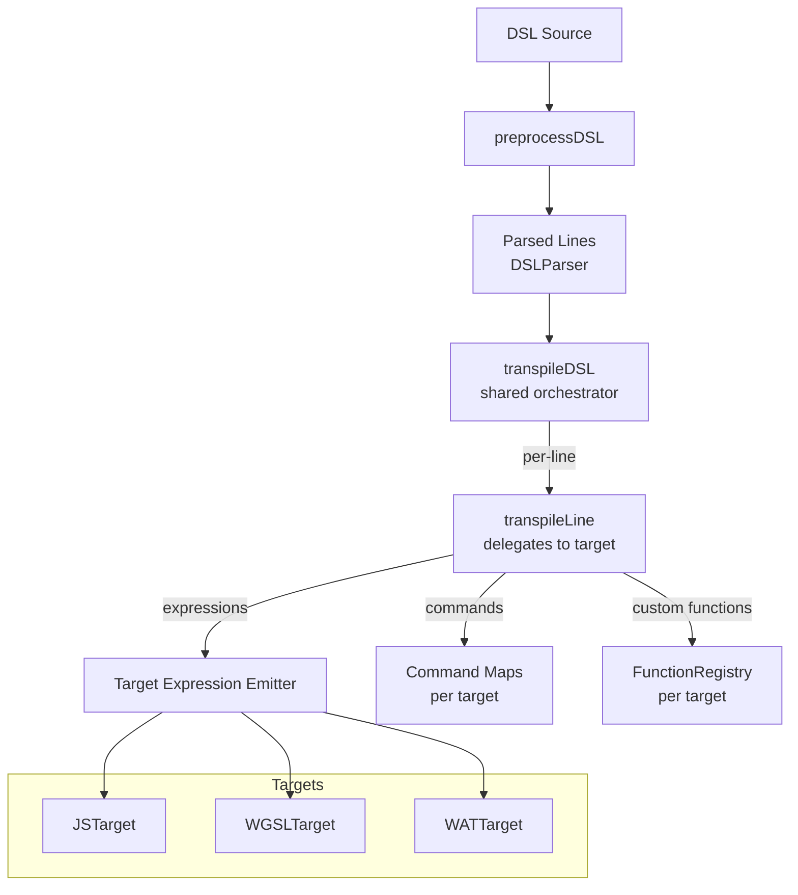

# DRY Compiler Refactor + Custom Function Registry

## Problem

Each compiler (JS, WGSL, WAT) independently implements:
1. [transpileLine](file:///Users/morgandaniel/Documents/dissertation/websimbench/src/simulation/compiler/WGSLcompiler.ts#213-451) — same switch/case structure, same DSL parse, different output per target
2. Custom functions ([neighbors](file:///Users/morgandaniel/Documents/dissertation/websimbench/tests/compiler/outputs/boids/output.js#40-51), [mean](file:///Users/morgandaniel/Documents/dissertation/websimbench/tests/compiler/outputs/boids/output.js#28-39), [sense](file:///Users/morgandaniel/Documents/dissertation/websimbench/tests/compiler/outputs/boids/output.js#52-78), [deposit](file:///Users/morgandaniel/Documents/dissertation/websimbench/tests/compiler/outputs/boids/output.js#79-98), [random](file:///Users/morgandaniel/Documents/dissertation/websimbench/tests/compiler/outputs/boids/output.js#16-24), [avoidObstacles](file:///Users/morgandaniel/Documents/dissertation/websimbench/tests/compiler/outputs/boids/output.js#100-126)) — hardcoded inline
3. [parseBoidsDSL](file:///Users/morgandaniel/Documents/dissertation/websimbench/src/simulation/compiler/WGSLcompiler.ts#452-523) — nearly identical iteration/error-reporting logic
4. COMMANDS maps — same keys, different templates

This results in ~1,800 lines of duplicated logic that drifts between backends.

## Architecture



## Proposed Changes

### Core Abstraction

#### [NEW] [compilerTarget.ts](file:///Users/morgandaniel/Documents/dissertation/websimbench/src/simulation/compiler/compilerTarget.ts)

Defines the `CompilerTarget` interface — the contract each backend implements:

```typescript
interface CompilerTarget {
  name: 'js' | 'wgsl' | 'wat';
  commands: CommandMap;
  
  // Expression transpilation
  emitExpression(expr: string, ctx: CompilationContext): string;
  
  // Statement generation for each parsed line type
  emitVar(name: string, expr: string, ctx: CompilationContext): string[];
  emitIf(condition: string, ctx: CompilationContext): string[];
  emitElseIf(condition: string, ctx: CompilationContext): string[];
  emitElse(ctx: CompilationContext): string[];
  emitFor(init: string, condition: string, increment: string, ctx: CompilationContext): string[];
  emitForeach(collection: string, varName: string, ctx: CompilationContext): string[];
  emitAssignment(target: string, expr: string, ctx: CompilationContext): string[];
  emitCommand(command: string, arg: string, ctx: CompilationContext): string[];
  emitCloseBrace(ctx: CompilationContext): string[];
  
  // Wrap transpiled statements into final output
  emitProgram(statements: string[], inputs: string[], randomInputs: string[], ctx: CompilationContext): string;
}
```

Also defines `CompilationContext` (shared state: variables, loop depth, loop var, random inputs, etc.) and `FunctionRegistry`.

---

#### [NEW] [functionRegistry.ts](file:///Users/morgandaniel/Documents/dissertation/websimbench/src/simulation/compiler/functionRegistry.ts)

Centralized registry of custom DSL functions. Each function has:
- Detection predicate (is this expression a call to this function?)
- Per-target code generator (emit the implementation for JS, WGSL, WAT)
- Per-target helper code (code that gets included in the output only if the function is actually used)

```typescript
interface DSLFunction {
  name: string;
  detect(expr: string): RegExpMatchArray | null;
  emitVar(match: RegExpMatchArray, varName: string, target: CompilerTarget, ctx: CompilationContext): string[];
  emitExpr?(match: RegExpMatchArray, target: CompilerTarget, ctx: CompilationContext): string;
  getHelpers?(targetName: string): string;  // only included if function is used
}
```

Functions registered: [neighbors](file:///Users/morgandaniel/Documents/dissertation/websimbench/tests/compiler/outputs/boids/output.js#40-51), [mean](file:///Users/morgandaniel/Documents/dissertation/websimbench/tests/compiler/outputs/boids/output.js#28-39), [sense](file:///Users/morgandaniel/Documents/dissertation/websimbench/tests/compiler/outputs/boids/output.js#52-78), [deposit](file:///Users/morgandaniel/Documents/dissertation/websimbench/tests/compiler/outputs/boids/output.js#79-98), [random](file:///Users/morgandaniel/Documents/dissertation/websimbench/tests/compiler/outputs/boids/output.js#16-24), [avoidObstacles](file:///Users/morgandaniel/Documents/dissertation/websimbench/tests/compiler/outputs/boids/output.js#100-126)

Dead-code elimination: helpers are only emitted for functions that are actually called in the DSL.

---

#### [NEW] [transpiler.ts](file:///Users/morgandaniel/Documents/dissertation/websimbench/src/simulation/compiler/transpiler.ts)

Shared orchestrator that replaces all 3 [parseBoidsDSL](file:///Users/morgandaniel/Documents/dissertation/websimbench/src/simulation/compiler/WGSLcompiler.ts#452-523) functions:

```typescript
function transpileDSL(lines: LineInfo[], target: CompilerTarget, logger: Logger, rawScript: string, randomInputs: string[]): string[] {
  // For each line: parse with DSLParser, delegate to target's emit methods
  // Check function registry first for custom function handling
  // Log errors for unknown syntax
}
```

---

### Backend Updates

#### [MODIFY] [JScompiler.ts](file:///Users/morgandaniel/Documents/dissertation/websimbench/src/simulation/compiler/JScompiler.ts)

- Remove [transpileLine](file:///Users/morgandaniel/Documents/dissertation/websimbench/src/simulation/compiler/WGSLcompiler.ts#213-451), [parseBoidsDSL](file:///Users/morgandaniel/Documents/dissertation/websimbench/src/simulation/compiler/WGSLcompiler.ts#452-523), inline helper generation
- Export `JSTarget` implementing `CompilerTarget`
- Keep JS-specific COMMANDS map
- [compileDSLtoJS](file:///Users/morgandaniel/Documents/dissertation/websimbench/src/simulation/compiler/JScompiler.ts#147-307) calls `transpileDSL` with `JSTarget`, then wraps in function shell

#### [MODIFY] [WGSLcompiler.ts](file:///Users/morgandaniel/Documents/dissertation/websimbench/src/simulation/compiler/WGSLcompiler.ts)

- Remove [transpileLine](file:///Users/morgandaniel/Documents/dissertation/websimbench/src/simulation/compiler/WGSLcompiler.ts#213-451), [parseBoidsDSL](file:///Users/morgandaniel/Documents/dissertation/websimbench/src/simulation/compiler/WGSLcompiler.ts#452-523), [transpileExpression](file:///Users/morgandaniel/Documents/dissertation/websimbench/src/simulation/compiler/WGSLcompiler.ts#95-212), [WGSLContext](file:///Users/morgandaniel/Documents/dissertation/websimbench/src/simulation/compiler/WGSLcompiler.ts#79-85)
- Export `WGSLTarget` implementing `CompilerTarget`
- Keep WGSL-specific COMMANDS map and `WGSL_HELPERS`
- [compileDSLtoWGSL](file:///Users/morgandaniel/Documents/dissertation/websimbench/src/simulation/compiler/WGSLcompiler.ts#524-631) calls `transpileDSL` with `WGSLTarget`, then wraps with structs/bindings

#### [MODIFY] [WATcompiler.ts](file:///Users/morgandaniel/Documents/dissertation/websimbench/src/simulation/compiler/WATcompiler.ts)

- Remove [transpileLine](file:///Users/morgandaniel/Documents/dissertation/websimbench/src/simulation/compiler/WGSLcompiler.ts#213-451), [tokenizeExpression](file:///Users/morgandaniel/Documents/dissertation/websimbench/src/simulation/compiler/WATcompiler.ts#34-81), [infixToSExpression](file:///Users/morgandaniel/Documents/dissertation/websimbench/src/simulation/compiler/WATcompiler.ts#82-213), [normalizeWASMExpression](file:///Users/morgandaniel/Documents/dissertation/websimbench/src/simulation/compiler/WATcompiler.ts#214-297), [normalizeWASMCondition](file:///Users/morgandaniel/Documents/dissertation/websimbench/src/simulation/compiler/WATcompiler.ts#298-326), [parseCondition](file:///Users/morgandaniel/Documents/dissertation/websimbench/src/simulation/compiler/WATcompiler.ts#327-341)
- Export `WATTarget` implementing `CompilerTarget`
- Keep WAT-specific COMMANDS map and S-expression logic
- [compileDSLtoWAT](file:///Users/morgandaniel/Documents/dissertation/websimbench/src/simulation/compiler/WATcompiler.ts#581-847) calls `transpileDSL` with `WATTarget`, then wraps with module shell

#### [MODIFY] [compiler.ts](file:///Users/morgandaniel/Documents/dissertation/websimbench/src/simulation/compiler/compiler.ts)

- No significant changes needed — it already delegates to per-target compile functions

---

## User Review Required

> [!IMPORTANT]
> The WAT compiler's expression handling (S-expression conversion) is fundamentally different from JS/WGSL. The `emitExpression` abstraction will keep WAT's infix→S-expression conversion internal to `WATTarget`, while JS uses the [expressionAST.ts](file:///Users/morgandaniel/Documents/dissertation/websimbench/src/simulation/compiler/expressionAST.ts) tree-walker and WGSL uses its regex-based transpiler. Each target retains its own expression strategy.

> [!WARNING]
> This is a significant refactor touching all compiler files. The existing 279 tests will serve as a regression safety net — no test should break.

## Verification Plan

### Automated Tests
- Run full test suite: `npx vitest run tests/compiler/` (279 tests must stay green)
- Add new tests for `FunctionRegistry` (detection, dead-code elimination)
- Verify compiled output is identical for all 6 simulations + 18 micro-simulations
